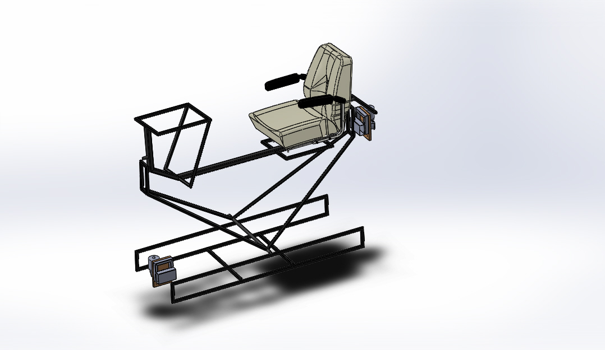
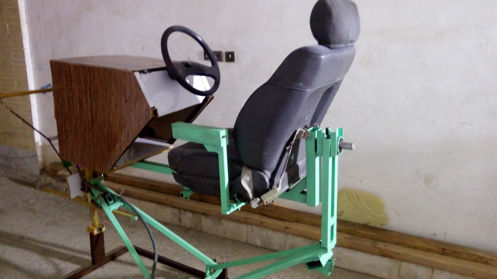

# 2D Car Racing Motion Simulator

 

2D Car racing motion simulator  with Wifi-BT connection and FFB decoding feature. 

### Hardware
The hardware consist of BT and WiFi link to the Game platform, Force evaluator board and Racing Rig
Two 24 volt DC electricemulate motor installed on Racing Rig to meulate the Pith & Roll motion
Two Pedals for emulation the Gas & Break along with Car Steer and setting buttons installed on the Rig
Following is the CAD design along with final fabrication

  
  

### Firmware
A ESP8266 core selected for Wifi Link and Server which can run in  access point. Any gaming platform such as laptop, smart phone, VR, can connect to the board with BT & Wifi Link
Special Webpage has been designed for FFB configuration and BT & Wifi setting. This Server can emulate whole keyboard for change of control the any game with keyboard
Following is the setting previews of the Webpage
-
-
 
 
 
